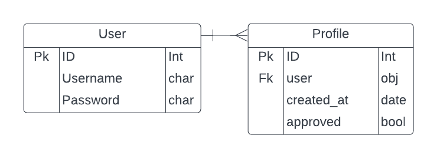
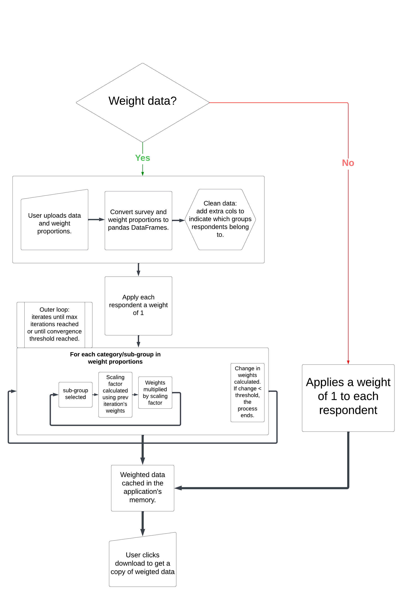
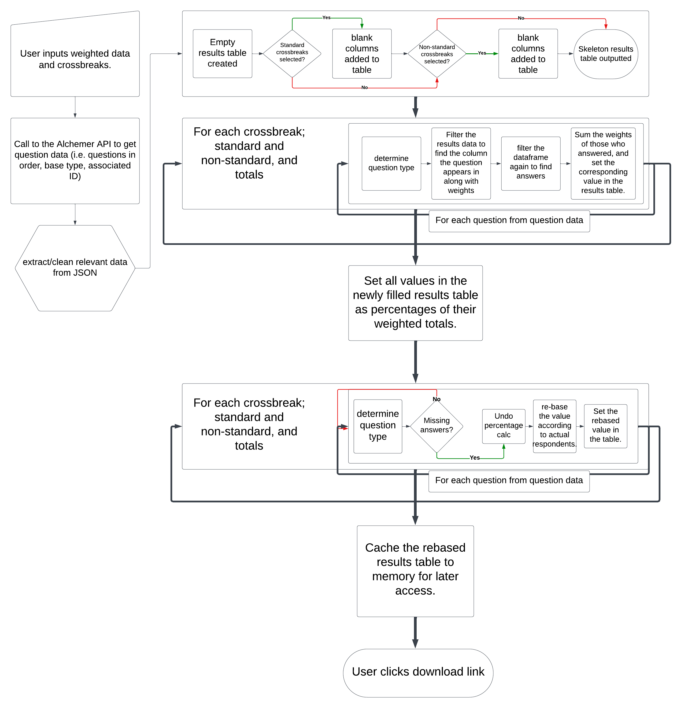

# Polling Analysis

This is the v1.0 release of a cloud-based application to allow Public First to generate polling tables.

## User Manual

<details>
<summary>Logging in</summary>

When you access the application for the first time, you will need to create an account or log in with an existing account.

Select the relevant option (login/signup) in the navbar.

If you are creating an account for the first time you will need to get an admin to approve your account/profile before you can access certain features of the site.

Once logged in you can log out at any time by clicking the log out button in the navbar.

</details>

<details>
<summary>Weighting data</summary>

### Weighting data provided by Alchemer

In order to weight survey data click on the link that says 'click here to weight survey responses'. From this page you will be prompted to upload 2 files. The first should be the survey data provided by Alchemer and the second should be the standard weighting proportions.

Please note that both of these files should be .xlsx files. Uploading a CSV here will result in a 500 error.

If you select the 'Customise your weights checkbox' option, you can use the remaining form fields to add any custom or standard weighting categories. If using this feature, please make sure that your weight proportions file matches the categories selected in your form.

Upon successful completion of weighting, the weights will be auto-downloaded to the user's machine. users will also be automatically redirected to the home page from where you selected the weighting option.

To download your weighted data, click on the link near the bottom of the home page entitled 'DOWNLOAD WEIGHTED DATA'. If all has gone well, the data will be downloaded to your machine. You may then open the file and scroll to the furthest column to the right and see a new column called 'weighted_respondents' which should contain the weights for each person who answered the survey.

If you wish to skip the weighting process for your survey, you will need to manually add a column with the name 'weighted_respondents' to the unweighted data and assign each respondent a value of 1. Automating this for unweighted surveys has not yet been implemented in this version of the application.
</details>

<details>
<summary>Calculations</summary>

### Running the calculations

This section will do broadly 3 things.
1. Work out the total number of people who belong in each cross break that you have selected.
1. Work out how the whole sample answered each question and how each crossbreak answered them.
1. Identify which questions were not answered by the entire sample and display their results as a percentage of those who *did* answer.

First, click on the link: 'Click here to run calculations for crossbreaks'

You will then be taken to a form where you can upload your weighted data. You will also need to enter the ID of the survey which can be found on the first page of the survey's survey legend.

Optionally, you can check or uncheck any standard crossbreaks that you would like to see data for. You can also specify non-standard crossbreaks for which you would like to see data for as well. This step is also optional. 

You may add as many non-standard crossbreaks as you like using the buttons, but note that the more you add, the longer it will take to process the whole batch.

When you're happy with your query, click the 'upload' button to run the calculations. You will then be taken back to the home page and you can keep track of the progress of your data processing with the progress bar that appears. 

When your calculations have finished, you should receive an email notifying you that they are done, provided that you have supplied an email address when signing up. If you wish to add or update an email address, please contact someone with administrator privileges.

When the calculations are complete, the data will be automatically cached in the browser awaiting download by the two buttons in the middle card on the home page. Currently you will have 5 minutes until these cached files are wiped and you will need to start again.

Make sure you have downloaded both files from this step before moving to the next step.

**NOTE: please refrain from submitting this form multiple times in quick succession as it relies upon a 3rd party API with limits on the number of requests that can be made per minute. If in doubt, give it 20 seconds or so after submitting to submit again.**
</details>

<details>
<summary>Polling Tables</summary>

### Making Polling Tables

This page will allow you to specify custom labels for questions that have a different base (i.e., the total sample of all respondents).

First, click on the link 'click here to scan the table for rebase comments'. This will take you to a page where you can upload the results you just downloaded from the previous step.

You will then be taken to a general form where you'll need to reupload the 2 files from the last step, specify a title for the tables, and select which questions to include in the tables.

Underneath this there will be a form to specify the rebase comments for rebased questions. The app will still work if you do not fill these in but in most cases these will all need to be filled in so that the polling table's numbers make sense.

Once you're happy with all the data in this form, click the 'run table-maker' button. After a few moments, you should be taken back to the home page. From here, you can click the 'Download polling tables button' to download your shiny new polling tables.

The tables themselves should have a 'cover page' worksheet, contents worksheet, full results page (detailing all the questions and all the answers), and a sheet for each individual question.
</details>

<details>
<summary>Automated Bot Checks</summary>

### Running bot checks

From the navbar, if you select 'check for bots' you will be directed to a page where you can upload raw polling data and run one of three automated bot checks.

Depending on the check you choose, the bot checker may take some time to run, however when it is finished you will receive an email notification similarly to when your crossbreaks are done.

To run a bot check, simply upload the file you want to check, select the option and submit the form.

If you are a Public First user, please note that using the check for whether answers make sense will use OpenAI credits. These are pay-per-use, so please ensure that you don't make more requests than you need to. This will ensure that we are not charged unnecessarily.

A faster bot-checker is currently in design/development, but please submit any ideas you have for features to Jeremy or another member of the data/development team.

</details>


## Technical Design

### Project architecture

This project is made up of several components/services. User auth data is hosted in an external postgres database. Static files are hosted on a separate platform.

The core part of the application is hosted on google cloud run in a single container. This container is currently running three services:
1. Django web application.
2. Celery worker for asynchronous processing of crossbreak data.
3. Redis instance for passing tasks and results between django and the celery worker.

The benefit of this more complex set up are:
1. The application does not 'hang' for several minutes while waiting for backend processing to be completed.
2. This allows django's front end to query the progress of the data processing in real time.

This is the same process that the bot checking feature follows.

It is NOT best practice to run several services in a single container, however since the app serves such a small number of users, it is functional for now.

#### Future plans for cloud architecture

The current roadmap for making improvements to this application's cloud configuration is to:
1. Adopt an IaC approach such as Terraform to specify cloud services in declarative code.
2. Replace the celery worker (essentially a cloned django web service) with a more lightweight cloud function
3. Replace redis with google pub/sub

This would have the following benefits:
* The application would run more optimally with proper separation of concerns; saving resources.
* The application would scale more easily if we needed it to.
* It would be easier to onboard more collaborators/maintainers to this project in future.
* It would avoid the large maintenance and cost sink of hosting this setup on a Kubernetes cluster.
* It would potentially avoid the costs/config/performance/compatibility issues of hosting multiple cloud run instances alongside a cloud memorystore redis instance.

### Database Schema

The Application does not currently require a large database to handle lots of user data. Currently the only models in use are the default django user model and a custom profile model. These are connected in a one-to-one relationship.

The profile model is configured to auto-generate an un-approved profile for each new user that is registered on the system. An admin can then log into the django admin page and update a user's profile approval status, enabling them access to the features of the application.



This database schema may be expanded in future as features are added to this application.

## Caching Database

This application uses caching to store data processed in the instance's memory for quick retrieval and download by the user.

Currently this is handled using django's default caching system. This works OK for our current use-case but has some potential drawbacks if the application was ever scaled to cater for many more users.
1. There is limited configuration/features for more advanced caching.
2. Caching using django's built-in caching system does not easily allow you to profile the impact on performance.
3. More critically, Django uses the application instance's own memory to store cached data. If the application were to be scaled up, the cloud computing cost of running would increase significantly, as cloud run instances are billed according to memory/CPU usage.
4. Given that the cache occupies memory, it also means that there are fewer resources in a cloud run instance that can be devoted to processing data.

There may be more efficient storage options if scaling up is necessary, e.g. Google Cloud's Memcached service.

### Data processing

The Pandas library for python is currently used to do the heavy lifting of data processing.

The following diagrams show the different processes that this project carries out on the survey data.

#### Weighting


<hr/>

#### Calculating Crossbreaks


<hr/>

### Producing Excel Files

In order to produce excel outputs of the polling table data, this project makes use of 2 libraries:

* [Xlsxwriter](https://xlsxwriter.readthedocs.io/)
* [Openpyxl](https://openpyxl.readthedocs.io/en/stable/)

The combination of the two of these enables the application to:
1. Efficiently *write* pandas dataframes to excel files with simple formatting. This is important because each question in the survey needs to have it's own excel sheet displaying the results, which can mean the excel file may contain hundreds of sheets. Being able to do this quickly reduces the performance bottleneck here. Xlsxwriter is designed for this purpose.
2. Implement style and format changes to the excel files that require the ability to read. For example, the headers that designate each set of crossbreaks are much more simply implemented if python can read the excel file and see exactly where each header needs to go. In order to do this with xlsxwriter, the headers would need to be added to the pandas dataframe beforehand which would be needlessly fiddly, and potentially slower.

There are some downsides, however to using both of these libraries together. Since they both alter the XML that makes up an excel file's structure in different ways, it's possible they may interfere with one another.

One example of this is writing hyperlinks to cells in xlsxwriter, then inserting rows (or performing other formatting changes) with openpyxl immediately after. I found this to cause the links to be completely wiped in the excel output, and they needed to be re-written with openpyxl instead.

## Front-End Design

### Wireframes

<details>
    <summary>Home page</summary>
    
</details>

<details>
    <summary>Log in page</summary>
    
</details>

<details>
    <summary>Instructions page</summary>
    
</details>

<details>
    <summary>Report page</summary>
    
</details>

<details>
    <summary>Weight form</summary>
    
</details>

<details>
    <summary>Crossbreaks form</summary>
    
</details>

<details>
    <summary>Table-maker form</summary>
    
</details>

## Local Development and Deployment


### Forking Repository

You can create a fork of this repository by doing the following things:
1. On this repository's GitHub page, navigate to the top right below the navbar.
2. Click on the fork button
3. Fill out the following form, optionally naming your fork.
4. Click 'create fork'


### Cloning Repository for Local Development

If you then would like to work on your fork locally, follow these steps:
1. On this repo's page, click the code button
2. Copy the link under HTTPS tab
3. In your own environment run the command `git clone`, pasting in the link you just copied.
4. This should download all project files to your working directory.
5. You can now add, commit, and push any changes to your own fork.
6. Next, in your Python environment run the command `pip install requirements.txt` to ensure you have all the necessary dependencies installed for this project.


### DEPLOYMENT PART 1: DATABASE

If you want to get your own version of this project off the ground, you'll need to set up a postgreSQL database instance. At the time of writing (DEC 2023), this can be done for free on a platform called [Aiven](https://aiven.io/), using their Digital Ocean hosted postgres service.

Follow these steps to create your ElephantSQL instance and connect it to your django project.
1. Create an account with Aiven.
2. Create an instance on whichever plan suits you best, selecting whichever data center is closest to your users.
3. After creating your instance access the database's details.
4. Copy the database URL to your clipboard.
5. Back in your IDE, make sure you have a file called env.py in your root directory. Make sure env.py is also in your .gitignore file before pushing anything to GitHub! If you forget to do this, unauthorised people might be able to access your database from your GitHub repo.
6. Import os at the top of the file, and set a secret key for django to use so that it can run securely.
```
import os

os.environ["SECRET_KEY"] = "my_super_secret_key"
```
7. Set the database url you just copied as an environment variable. This can be done with the following line:
```
os.environ["DATABASE_URL"] = YOUR_DB_URL
```
8. Next, add an environment variable called DEV and set it to any value that will return True in boolean logic. I have gone for a string; 'DEV'. This will be used to set Django's Debug setting to True if DEV exists and false if not. This allows us to automate switching debug modes between development and production environments.
```
os.environ["DEV"] = 'DEV'
```
9. In settings.py in the polling_analyser directory, replace the DATABASES variable with the following snippet to access your database securely in production, and just use the default SQLite db provided by django for development.
```
if "DEV" in os.environ:
    DATABASES = {
        'default': {
            'ENGINE': 'django.db.backends.sqlite3',
            'NAME': BASE_DIR / 'db.sqlite3',
        }
    }
else:
    DATABASES = {
        'default': dj_database_url.parse(os.environ.get("DATABASE_URL"))
    }
```
10. I will talk more about production shortly, but for now we need to connect to our production db temporarily and create a superuser. This will allow us to be able to log in properly when we deploy our application. So, temporarily comment-out the code we just added to our settings.py file. Just below it, add the following so that django connects to your db in your local development environment.
```
DATABASES = {
    'default': dj_database_url.parse(os.environ.get("DATABASE_URL"))
}
```
11. In your terminal, run `python manage.py migrate` to first migrate the installed apps in settings.py as well as the database models to the production database. Please do this before creating a superuser. If you don't, you risk not getting a profile auto-created for your superuser account.
12. Run `python manage.py createsuperuser`. You will be asked to provide a username, email, password, and password confirmation. It's optional to provide an email, but it may be useful if you decide in future to set up password reset via SMTP (password reset emails).
13. Once your superuser is created, you will need to approve your own profile to access the features of the application with this account. The simplest way to do this is in your local development environment (while you're still connected to the production database). Therefore, run this command to launch the application on localhost: `python manage.py runserver`.
14. If the app does not launch successfully and you get a django error message, you may need to adjust your ALLOWED_HOSTS variable in settings.py. If another error is the problem, consult django docs or chatgpt.
15. When you successfully access the site, go to the url and add /admin to the end. This will take you to a log in page where you can log in with your superuser account.
16. Once logged in, access the 'Profiles' option in the list of options. From the list of profiles, tick the box next to your superuser and from the dropdown menu select 'approve profiles'. Hit go and you should be all set. Your production database should be set up with a superuser.
17. You can now close the localhosted application and un-comment/reset the DATABASES variable to the following:
```
if "DEV" in os.environ:
    DATABASES = {
        'default': {
            'ENGINE': 'django.db.backends.sqlite3',
            'NAME': BASE_DIR / 'db.sqlite3',
        }
    }
else:
    DATABASES = {
        'default': dj_database_url.parse(os.environ.get("DATABASE_URL"))
    }
```


### DEPLOYMENT PART 2: HOSTING STATIC FILES

Django, and the cloud instance that hosts it on the web, are not very good at serving front end files like CSS, JavaScript, and media files. Therefore we need to use a service like [Cloudinary](https://cloudinary.com/) to host them for us. We can access them from django in a similar way to the way we access our database; using a url to connect to their content delivery network. This means we will need to add a new environment variable to our env.py file to enable access to remote storage.

1. Sign up for free on [Cloudinary](https://cloudinary.com/). I recommend using GitHub SSO for convenience.
2. Navigate to the dashboard on the programable media tab and copy the value for the API environment variable.
3. Paste this value into an environment variable in env.py:
```
os.environ["CLOUDINARY_URL"] = YOUR_CLOUDINARY_URL
```
4. The settings.py file should be configured to use cloudinary as static file storage. Just in case, please make sure that in INSTALLED_APPS, `django.contrib.staticfiles` comes before `cloudinary_storage`.
5. Make sure that the following are in settings.py (they should be in the file already):
```
STATIC_URL = '/static/'
STATICFILES_STORAGE = 'cloudinary_storage.storage.StaticHashedCloudinaryStorage'
```
6. To upload your static files to cloudinary, run the following command in your termial: `python manage.py collectstatic`.
7. You will then be prompted about whether you want to overwrite the files that are already uploaded there. Type yes and hit 'enter'.
8. Wait for the upload to complete. It might take a minute or two to do and there's no progress bar for it in the terminal, so patience is the name of the game.
9. Once it's finished, there will be a prompt to say which files have been changed. From here, go back to your cloudinary account, select the nexus tab > media library > Assets. You should be able to see your files uploaded successfully to the platform.
10. You may be wondering. Do I need to run collectstatic every time I change a file? Short answer is no. If your DEBUG is set to True for production, then django will serve all static files by default (cloudinary doesn't come into the picture). That means we only need to worry about collectstatic being run when we deploy, and this can be automated. Read on to see how to do that.


### DEPLOYMENT PART 3: CONNECTING TO ALCHEMER

By this point, you will have set up a database and static hosting for your application. Now you'll need to make sure you have up-to-date Alchemer API credentials in your env.py file.

1. If you have not been granted an API key, ask whoever administers your Alchemer account to create one for you. Docs can be found [here](https://apihelp.alchemer.com/help)
2. Log in to your account and navigate to your profile.
3. Copy the credentials and paste them into environment variables in your env.py file. Please note that if you name your versions of these variables differently, it will break the portion of code that relies on it and you'll need to rename it there / anywhere you want to make a request to the Alchemer API.
```
os.environ.setdefault("API_SECRET", "YOUR SECRET HERE")
os.environ.setdefault("API_TOKEN", "YOUR TOKEN HERE")
```

### DEPLOYMENT PART 4a: THE DOCKERFILE...

This project uses docker when deploying. If you're not familiar with docker, it would be worth reading about it and how it works so you can better understand what the dockerfile does in this project.

The dockerfile in this project broadly does the following:
* Specifies the python build to use from linux
* Install linux packages needed to support third party python libraries.
* Install redis server to handle running redis in the same container as the django application (not recommended usually but works for our use-case).

* Sets build arguments that will map on to the environment variables as well as other arguments that zeet will need to build and deploy the application.
* Install python dependencies
* Run python manage.py collectstatic command
* Run a third party script to ensure the file run.sh is compiled in a way that is compatibile with Linux.
* Run the file run.sh to launch the application. This file contains extra commands to start the redis server, a celery worker, and the gunicorn server for the django application in this order.


### DEPLOYMENT PART 4b: AUTOMATING GOOGLE CLOUD DEPLOYMENTS WITH ZEET

Django is great because there is loads of documentation and support for deploying applications to the web. It also has a lot of security feature built in. You can make use of PaaS (platform as a service) providers like Heroku, Render, etc. to deploy very easily. However, for *this* application it makes more sense to leverage the resources of IaaS (infrastructure as a service) providers like AWS, Azure, GCP. These services give you far more control over resources and usage, especially if you go for a 'serverless' offering. You can assign more memory/processing power if needed and can choose to only pay for what you need.

This brings it's own set of challenges, however since IaaS providers offer so many different products, services, microservices, etc. It can be difficult and time consuming to deploy to the cloud especially if you've never done it before. That's where a service like [Zeet](https://zeet.co/) comes in very handy. It makes deploying an app to the cloud as simple as a PaaS interface like Heroku or Render. What's more, the Zeet team are super friendly and happy to help with any questions you have about cloud deployment.

Here's how to get started with Zeet.
1. Strangely enough, you actually need to start off by creating an account with the cloud provider of your choice. I recommend choosing Google Cloud Platform (GCP) because the rest of the documentation will assume you're using Google Cloud Run. However, if you want you could use AWS or Azure. Zeet supports other clouds including CoreWeave, DigitalOcean, Linode, Vultr. Feel free to read around and find the best option to suit you.
2. Go to [Google Cloud](https://cloud.google.com/gcp?utm_source=google&utm_medium=cpc&utm_campaign=emea-gb-all-en-bkws-all-all-trial-e-gcp-1011340&utm_content=text-ad-none-any-DEV_c-CRE_495030365498-ADGP_Hybrid+%7C+BKWS+-+EXA+%7C+Txt+~+GCP+~+General%23v2-KWID_43700060384861699-kwd-6458750523-userloc_1006886&utm_term=KW_google+cloud-NET_g-PLAC_&&gad_source=1&gclid=CjwKCAiA98WrBhAYEiwA2WvhOlTAj3ut20Oc_Fy7T7ti-8iOdXSGQ7Jtf46eHpFjiCzusxLK9z-kyxoCeeMQAvD_BwE&gclsrc=aw.ds&hl=en) and click on Go to console. If you have a google account already, you should be able to start your free trial straight away. Otherwise, please create a google account.
3. Next create an account with [Zeet](https://zeet.co/). I recommend using GitHub SSO for ease of integration.
4. Select the clouds tab and click on new cloud.
5. Select the cloud provider you are going to use from the list.
6. If you have chosen google cloud as I suggested, you'll first need to set up a service account in your cloud to give Zeet permission to perform actions in your cloud space. It's a security measure to ensure unauthorised apps don't do stuff that could get you billed a lot of money. Zeet has some helpful documentation to do this. Just follow their steps and provide them with the details of the service account.
7. Once you've done this, you'll need to go back to your google cloud account and enable billing. You'll have to enter some card details to be allowed to host anything in order to prove you're not a robot. However, you shouldn't be charged anything in your first 3 months.
8. Now that all this is done, it's time to deploy. In the Zeet projects tab, select 'New Project'.
9. Select 'Google Cloud Run' as the blueprint.
10. You'll then be prompted to connect your GitHub account. If you used GitHub SSO, you might skip this step.
11. Select the repository you want to deploy - this should be your fork of the project.
12. In the 'target' section, select the region you want the application to be hosted in. Select one that's closest to most of your users.
13. Next, in the inputs section, select 'Dockerfile' as your build template/build method. Set the docker context to ./ (i.e. the root directory). You'll need to supply the file path to the dockerfile. If you're just cloning this project, you should just be able to put 'Dockerfile' in this field.
14. The dockerfile that exists in this GitHub repository should define all the build and run commands that the container will need to be generated and to launch the web app (gunicorn in this case). Feel free to adjust this if needed but please be aware that if you make too many alterations you might cause unexpected behaviours in the building and running of the application.
15. Directly under the 'Build & Run' section, copy over all the environment variables you have set in your env.py file (your env file should only be saved in your local directory, not on GitHub!!!).
16. PLEASE DO NOT copy over the 'DEV' environment variable. This is ONLY to be used in the development environment and not in production. Having DEV here in production will open up security vulnerabilities and potentially break features. As mentioned earlier it will set Django's debug setting to true.
17. Directly under the environment variables section, you'll see a section called Serverless Resources. Here you can specify how much memory and CPU you want your container instances to have. I usually set it to 8GB RAM and 2 CPU cores.
18. In the 'organize' tab give your project/group/subgroup a name each. Up to you what they are.
19. When you're ready, click 'Deploy'
20. You can also set Zeet to automatically deploy your main branch to GCP whenever you push changes to GitHub.

Bonus tip: once you have created your project in zeet and at least attempted a deployment, you can make adjustments to your zeet builder as needed. Select your project, and navigate to the settings tab. Here you can make any changes to the information you entered earlier. If you select the 'advanced' option in the inner side menu, it will take you to a form where you can add more resources to the zeet builder in case you're ever running out of memory to build docker images.


### DEPLOYMENT PART 5: GOOGLE CLOUD RUN CONFIG

By now, if you've followed all the steps, you should have a fully deployed version of the application live on your chosen IaaS account. If you have used Google Cloud Run, this will be a serverless application (meaning you will only pay for what you use in terms of resources). Here are some steps to follow to make edits to the instances once it's deployed.
1. In your Google Cloud account, select the project that you're working in.
2. Find Google Cloud Run using the search bar or the side tab.
3. In your Google Cloud Run dashboard for your project, click the 'revisions' tab.
4. Click on the option to 'Edit & Deploy a New Revision'.


### DEPLOYMENT PART 6: OPTIMISING PERFORMANCE

Here are some things you can do to ensure that the cloud-hosted version runs as efficiently as possible.
1. Remove any print statements from the application (print statements have negligible effect locally, but on GCP they can slow things down due to the platform's own logging feature recording printed data).
2. Remove any pandas to_csv() statements that are not essential to the logic of the application.
